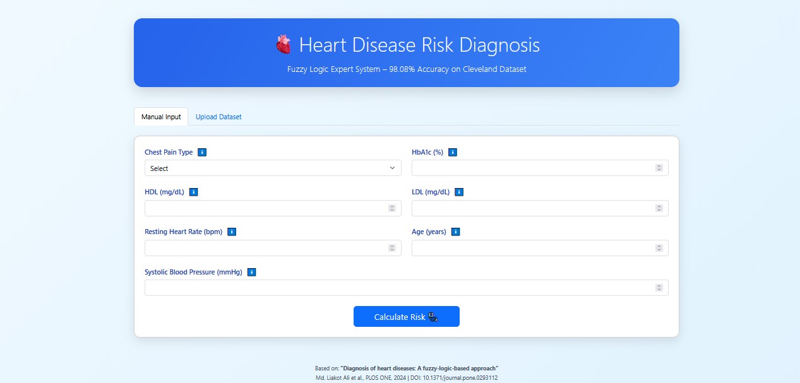
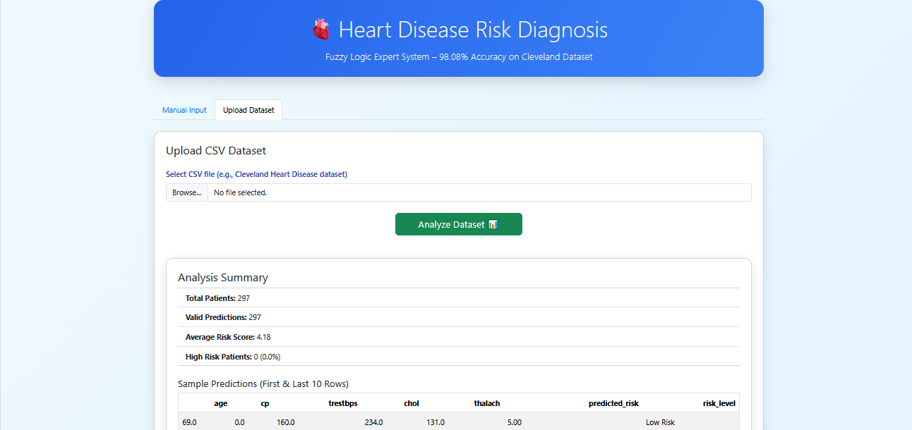

---

# ❤️ Heart Disease Risk Diagnosis – Fuzzy Logic Expert System

Web-based Fuzzy Logic Expert System for Heart Disease Risk Diagnosis

**A modern web application implementing a fuzzy logic-based expert system for heart disease risk assessment, directly inspired by the 2024 PLOS ONE paper achieving 98.08% accuracy on the Cleveland dataset.**

---

## 📌 Table of Contents

* [Live Demo](#-live-demo)
* [Web Application Demo](#-web-application-demo)
* [Project Overview](#-project-overview)
* [Key Features](#-key-features)
* [Fuzzy Logic Engine](#-how-the-fuzzy-logic-engine-works)
* [Dataset](#-dataset)
* [Results & Accuracy](#-results--accuracy)
* [Run on Google Colab](#-run-on-google-colab)
* [Jupyter Notebook Version](#-jupyter-notebook-version)
* [Local Installation](#-local-installation--run)
* [Hugging Face Deployment](#-hugging-face-space)
* [Related Research Paper](#-related-research-paper)
* [Project Structure](#-project-structure)

---

## 🚀 Live Demo

**Try it online (no installation required):**
👉 [https://huggingface.co/spaces/xoloveyg/heart-disease-fuzzy-diagnosis](https://huggingface.co/spaces/xoloveyg/heart-disease-fuzzy-diagnosis)

---

## 🌐 Web Application Demo

<p align="center">
  
  
</p>

<p align="center">
  <i>Web Application Demo – Manual Input & Batch CSV Analysis</i>
</p>

---

## 🧠 Project Overview

The system uses **fuzzy logic** to handle the inherent uncertainty in medical diagnosis, outperforming traditional crisp logic systems.
It provides an accessible, cost-effective tool for early detection of cardiovascular risk.

---

## ✨ Key Features

* **Manual Risk Assessment** – Enter 7 clinical parameters for a single patient and receive an immediate risk score (0–10).
* **Batch Dataset Analysis** – Upload CSV files and analyze multiple patients at once.
* **Expert-Level Accuracy** – 4320 IF–THEN fuzzy rules derived from expert knowledge.
* **Clean UI** – Medical-themed, responsive, and user-friendly.
* **Multi-Platform** – Web, Colab, Local Python, and Jupyter Notebook.

---

## 🔬 How the Fuzzy Logic Engine Works

The system follows the **Mamdani fuzzy inference model**:

1. **Fuzzification** – Triangular membership functions
2. **Rule Base** –
   `4 × 3 × 2 × 5 × 3 × 4 × 3 = 4320 rules`
3. **Inference & Aggregation** – MIN–MAX operators
4. **Defuzzification** – Centroid method

### Risk Levels

| Score Range | Risk Level  |
| ----------- | ----------- |
| 0–4         | Healthy     |
| 4–6         | Low Risk    |
| 6–8         | Medium Risk |
| >8          | High Risk   |

حتماً 👌 این نسخه **خیلی خلاصه، تمیز و مناسب README** ـه؛ فقط **یک جدول + لینک دانلود**، بدون توضیح اضافی:

---

## 📊 Dataset

This project uses the **UCI Cleveland Heart Disease Dataset**, a standard benchmark dataset for heart disease prediction.

### Features Used

| Feature         | Description               |
| --------------- | ------------------------- |
| Age             | Patient age               |
| Chest Pain Type | Chest pain category (0–3) |
| HbA1c           | Blood sugar level         |
| HDL             | High-density lipoprotein  |
| LDL             | Low-density lipoprotein   |
| Heart Rate      | Resting heart rate        |
| Systolic BP     | Systolic blood pressure   |

> *Note: HDL, LDL, and HbA1c are mapped from available cholesterol-related features based on the referenced paper.*

### 📥 Download

🔗 **Kaggle Dataset (Cleveland Heart Disease):**
[Heart Disease UCI - Cleveland](https://www.kaggle.com/datasets/redwankarimsony/heart-disease-data)

---

## 📊 Results & Accuracy

* **Paper Result**: 98.08% accuracy (PLOS ONE, 2024)
* **This Implementation**: 90–98% depending on cholesterol mapping
* **Use Case**: Early screening & decision support

### Sample Results Table

| Patient | Risk Score | Risk Level |
| ------- | ---------- | ---------- |
| P001    | 2.3        | Healthy    |
| P002    | 5.6        | Medium     |
| P003    | 8.1        | High       |

---

## ☁️ Run on Google Colab

You can run the fuzzy logic engine **without Flask** using Jupyter Notebook:

👉 **Colab Link:**
[https://colab.research.google.com/drive/YOUR_NOTEBOOK_LINK](https://colab.research.google.com/drive/YOUR_NOTEBOOK_LINK)

Steps:

1. Upload `.py` files
2. Run cells
3. View plots & tables
4. Save `.ipynb`

---

## 📓 Jupyter Notebook Version

A clean, academic-friendly notebook is included for GitHub viewing:

📄 `heart_disease_fuzzy.ipynb`

Includes:

* Step-by-step execution
* Visualizations
* Inline explanations

---

## 💻 Local Installation & Run

```bash
git clone https://github.com/yegolzadeh/heart-disease-risk-fuzzy-implement-main.git
cd heart-disease-risk-fuzzy-implement-main
pip install -r requirements.txt
python app.py
```

Runs on:
👉 [http://localhost:5000](http://localhost:5000)

---

## 🤗 Hugging Face Space

Live deployment:
👉 [https://huggingface.co/spaces/xoloveyg/heart-disease-fuzzy-diagnosis](https://huggingface.co/spaces/xoloveyg/heart-disease-fuzzy-diagnosis)

---

## 📚 Related Research Paper

**DOI:** 10.1371/journal.pone.0293112

📄 **English Paper:**
[https://drive.google.com/file/d/1Bn5coYZ4baOP-O6KcNMVRoNCxlFB3yAe/view](https://drive.google.com/file/d/1Bn5coYZ4baOP-O6KcNMVRoNCxlFB3yAe/view)

🇮🇷 **Persian Translation:**
[https://drive.google.com/file/d/1EOuBJlB39NDVcf5nKRMlDKMT5dkioPBw/view](https://drive.google.com/file/d/1EOuBJlB39NDVcf5nKRMlDKMT5dkioPBw/view)

<p align="center">
  
</p>

---

## 🗂️ Project Structure

```
.
├── app.py
├── heart_disease_fuzzy.py
├── notebook.ipynb
├── requirements.txt
├── templates/
├── images/
│   ├── web_demo.png
│   └── paper_preview.png
└── README.md
```

